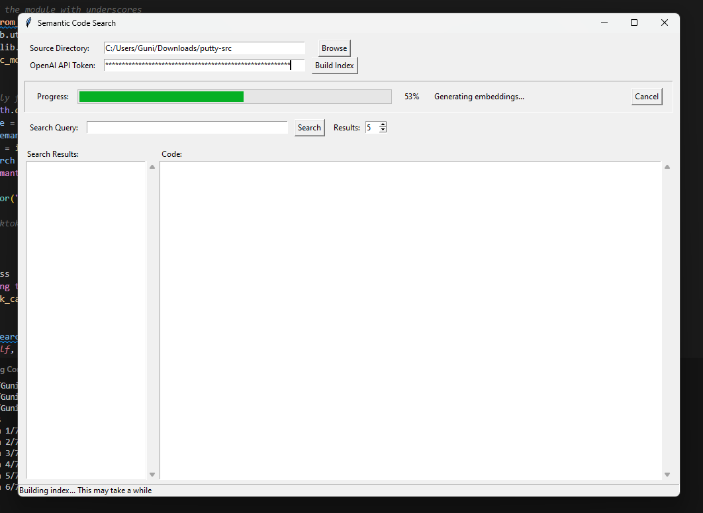
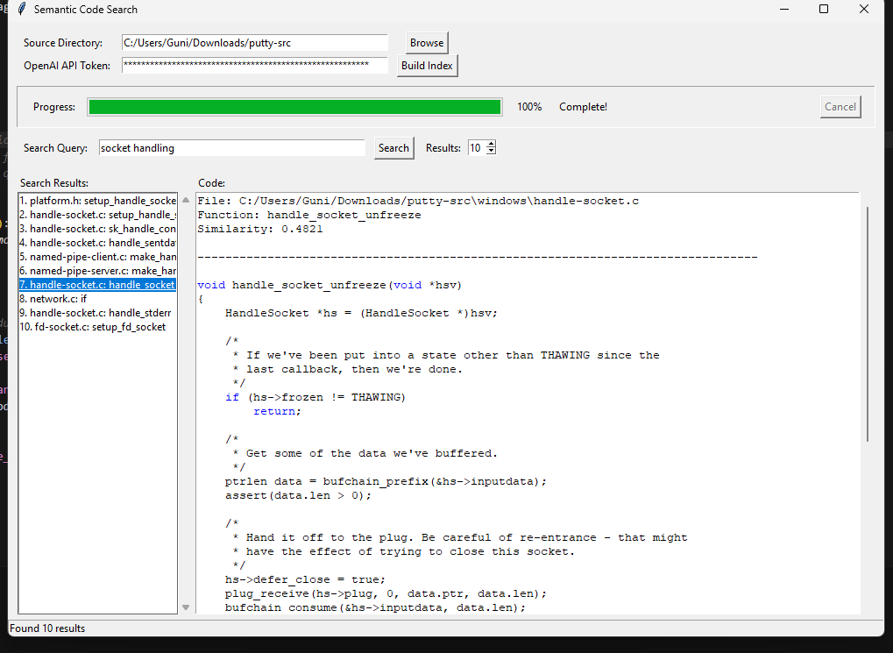

# Code Search Tool for Developers
### Author: Guni 

A tool for searching through codebases using natural language queries powered by OpenAI embeddings.

## Overview

This project provides a semantic search capability for code repositories, allowing developers to find relevant code snippets using natural language queries instead of exact keyword matches. It leverages OpenAI's embedding models to create vector representations of code snippets and queries, then uses cosine similarity to find the most relevant matches.

## Features

- **Natural Language Search**: Search your codebase using plain English
- **Semantic Understanding**: Finds conceptually similar code, not just keyword matches
- **C/C++ Support**: Optimized for C and C++ codebases (like Putty)
- **Interactive UI**: User-friendly interface with real-time progress tracking
- **Code Syntax Highlighting**: Basic syntax highlighting for easier code reading
- **Token Management**: Automatically handles token limits for the OpenAI API

## Screenshots

### Building the Index


The screenshot shows the application building an index for the Putty source code. The progress bar indicates that 53% of the process is complete, and it's currently in the "Generating embeddings..." phase.

### Searching for Code


The screenshot demonstrates searching for "socket handling" in the Putty codebase. The application found 10 relevant results, showing functions that deal with socket handling. The selected result displays the `handle_socket_unfreeze` function from the handle-socket.c file, with a similarity score of 0.4821.

## Requirements

- OpenAI API key
- Required Python packages:
  - `numpy`
  - `scikit-learn`
  - `openai`
  - `tiktoken`
  - `tkinter` (usually included with Python)

## Installation

1. Download the source code files
2. Install the required dependencies:

```bash
pip install numpy scikit-learn openai tiktoken
```

## Files

- `semantic_code_search.py`: Core search engine with OpenAI integration
- `ui.py`: Graphical user interface for the search tool
- `language_keywords.json`: keywords of different languages to highlight

## Usage

### Running the Application

1. Open a terminal or command prompt
2. Navigate to the directory containing the code
3. Run the UI:

```bash
python ui.py
```

### Building an Index

1. In the UI, enter the path to your source code directory for example putty-src
2. Enter your OpenAI API key
3. Click "Build Index"
4. The progress bar will show indexing status - this may take some time for large codebases

### Searching for Code

1. After the index is built, enter a natural language query in the search box
2. Set the desired number of results (default: 5)
3. Click "Search"
4. Results will appear in the left panel - click on any result to view the code

## How It Works

1. **Code Parsing**: The tool recursively scans your source directory and extracts functions and code blocks
2. **Embedding Generation**: OpenAI's API converts each code snippet into a vector representation
3. **Semantic Search**: When you enter a query, it's converted to an embedding and compared to all code snippets
4. **Similarity Ranking**: Uses cosine similarity to find the most semantically similar code snippets

## Example Queries

- "How does socket connection work?"
- "Code for handling SSH authentication"
- "Function that validates user input"
- "Error handling implementation"
- "Memory allocation management"
